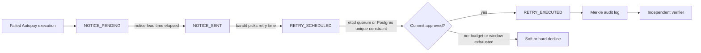

# Consensus Recovery Agent

> Everyone builds agents that act. This one decides when it's safe to act.


Built solo for Razorpay's hackathon, Track 3: AI Revenue Recovery. It recovers failed UPI Autopay payments, and the actual hard part isn't retrying, it's knowing when a retry is legal, safe, and worth the attempt before anything fires.

## Table of Contents

- [Consensus Recovery Agent](#consensus-recovery-agent)
  - [Table of Contents](#table-of-contents)
  - [What it does](#what-it-does)
  - [Status](#status)
  - [Regulatory grounding](#regulatory-grounding)
  - [Configuration: what's regulation, what's me](#configuration-whats-regulation-whats-me)
  - [Honest limitations](#honest-limitations)
  - [Load test numbers](#load-test-numbers)
  - [Running the demo](#running-the-demo)
  - [Running the tests](#running-the-tests)
  - [Roadmap](#roadmap)

## What it does

When a UPI Autopay mandate execution fails, someone has to decide what happens next: retry now, retry later, send a notice first, or give up. Most "agentic" systems answer that question by taking an action. This one spends most of its logic answering a narrower question first: is it even allowed to act right now.



The core is a deterministic finite state machine (`app/core/state_machine.py`) that walks a failed case through states like `NOTICE_PENDING`, `NOTICE_SENT`, `RETRY_SCHEDULED`, and `RETRY_EXECUTED`. Every transition is checked against NPCI's retry rules and RBI's mandate limits before it happens, not after.

A few things make this more than a state machine with a YAML file behind it:

- **Real consensus for execution approval.** A 3-node etcd cluster (`app/core/commit_backend.py`) has to agree before a retry executes when multiple workers are running. Kill the leader mid-flight and a new one gets elected; the case doesn't get double-executed.
- **An independent verifier.** `app/core/verifier.py` re-checks every committed decision against the same NPCI rules, but through a separate code path from the one that made the decision. If the state machine and the verifier ever disagree, that's a bug, and the verifier is the one that gets believed.
- **A Merkle-chained audit trail.** Every state transition gets hashed into a chain, so tampering with history is detectable instead of just logged.
- **Advisory ML, kept firmly advisory.** An epsilon-greedy bandit (`app/core/bandit.py`) and a Kaplan-Meier survival model (`app/core/survival.py`) suggest retry timing. A cross-mandate distress detector (`app/core/distress.py`) flags customers getting hit by too many mandates across products at once. None of these get a vote on whether execution happens. That decision belongs to the state machine and the verifier, full stop.
- **A read-only LLM layer.** `app/explain/llm_explainer.py` explains a decision in plain English after it's made. `app/explain/decline_proposer.py` proposes soft vs hard decline classifications. Neither one executes anything.

Small aside: the verifier had a real bug for the first 20 hours of the build. It compared the gap between `NOTICE_SENT` and `RETRY_SCHEDULED` instead of `NOTICE_SENT` and `RETRY_EXECUTED`, and since both of the first two timestamps get logged synchronously, the gap looked fine even when the actual notice lead time wasn't respected. Full story's in `docs/WHAT_BROKE.md`.

Six behaviors do most of the actual work: a soft/hard decline router, a retry-budget optimizer, a per-instrument fraud self-throttle, a system-wide self-throttle, pre-debit notice lead time and DND-hour deferral, and a rule-citation receipt attached to every decision so you can see exactly which NPCI or RBI clause justified it. That fifth one used to say "notice deduplication" in an earlier draft, which overstated it: there's a `NoticeRecord` model and a DND-hours check (`app/core/dnd.py`), not an actual batching or dedup service. Fixed the wording rather than rushing a feature in to match the claim.

## Status

110 tests pass (verified at time of writing). Run `pytest -q` yourself if you want the current number; the codebase moves fast enough that this line can go stale within a day. For the incidents that got the build here, including the verifier bug above, see `docs/WHAT_BROKE.md`.

## Regulatory grounding

This isn't a system with retry logic that happens to reference compliance. The rules come first.

- **NPCI circular, dated May 21, 2025, effective August 1, 2025.** Caps retries at 1 execution attempt plus 3 retries. Blocks retries during peak hours: 10:00 to 13:00 and 17:00 to 21:30 IST.
- **RBI circular RBI/2023-2024/88, December 12, 2023.** Sets the Additional Factor of Authentication ceiling at ₹1,00,000 for mutual funds and insurance, with a default ceiling of ₹15,000 for everything else.

`config/npci_rules.yaml` encodes these directly. If a number in that file doesn't match the circular text, that's a bug in the config, not a design choice.

## Configuration: what's regulation, what's me

Two different kinds of rules live in this codebase and I've kept them in separate places on purpose:

- **`npci_rules`**: sourced from the actual NPCI and RBI circulars above. These aren't tunable in spirit, only in the sense that the YAML file happens to let you edit them.
- **`self_imposed`**: my own conservative defaults, specifically a 72-hour minimum spacing between retries and a 48-hour maximum retry window. NPCI doesn't mandate either number. I picked them because they felt like reasonable guardrails, not because a circular told me to.

If you're evaluating this for compliance, treat `npci_rules` as the part that has to be right and `self_imposed` as the part that's an opinion.

## Honest limitations

- There's no real Razorpay webhook capture. The failed-payment parser is validated against synthetic payloads, not live webhook traffic.
- The 72-hour spacing and 48-hour window mentioned above are mine, not NPCI's. Worth repeating, since it's the kind of detail that gets lost in a demo.
- Admin endpoints are unauthenticated in the demo profile. Don't point this at the internet as-is.
- The ML modules are advisory or read-only. They inform, they never decide. Execution approval runs through the state machine and the consensus backend, not through a model.
- There's no trained XGBoost model anywhere. The classifier is rule-based with a safe default fallback. I'd rather ship something honest and simple than something that looks trained and isn't.

## Load test numbers

- **1157 req/s** on `/admin/simulate-failure`, a synthetic fault-injection endpoint. This measures how fast the service accepts failure events, not how fast it commits retries through consensus.
- **355 req/s** on `/admin/execute-retry`, and most of those requests are rejections, not successful commits. Read it as a rejection-path number, not a commit-throughput benchmark.

This part's a little hacky to explain cleanly: the 1157 figure doesn't touch the etcd-backed commit path at all, so treat it as an upper bound on ingestion, not proof of consensus throughput. I haven't run a dedicated commit-path benchmark yet, and I'd rather say that plainly than let the numbers imply something they don't.

## Running the demo

Single worker:

```bash
export CONFIG_PROFILE=demo
export USE_ETCD=true
export USE_POSTGRES=true
export RAZORPAY_WEBHOOK_SECRET=test_secret_123

docker-compose up -d etcd1 etcd2 etcd3 postgres
uvicorn app.main:app --reload
```

Without those environment variables the app boots on its defaults: prod profile, in-memory store, no etcd. It'll run, but it won't show you anything.

Multi-instance, to see the exactly-once behavior under real contention: run three separate processes rather than `--workers N`. A plain `uvicorn --workers 4` spins up four processes that each get their own in-memory case store unless `USE_POSTGRES` is set, so they never actually contend for the same case, and the demo falls flat. Three instances on separate ports, all pointed at the same etcd cluster and Postgres, is the setup that actually works:

```bash
export CONFIG_PROFILE=demo
export USE_ETCD=true
export USE_POSTGRES=true
export RAZORPAY_WEBHOOK_SECRET=test_secret_123

docker-compose up -d etcd1 etcd2 etcd3 postgres

uvicorn app.main:app --port 8001 &
uvicorn app.main:app --port 8002 &
uvicorn app.main:app --port 8003 &
```

Fire the same retry-execution request at all three ports at once and one of them commits, the rest get rejected by the etcd quorum. That's the whole point of the demo.

Then drive a case through the admin endpoints, or watch it from `dashboard/streamlit_app.py`.

## Running the tests

```bash
pytest -q
```

## Roadmap

- Real Razorpay webhook capture, replacing the synthetic payload validation.
- TLA+ model checking. The spec exists; it hasn't been run through a model checker yet.
- A trained ML classifier to replace the current rule-based one.
- A multi-rail router for payment rails beyond UPI.
- A Wasm build of the state machine, for portability outside Python.
- Multi-DC failover for the consensus layer.