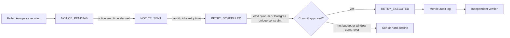
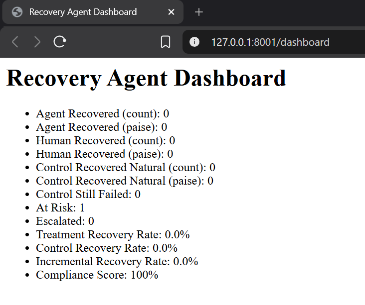
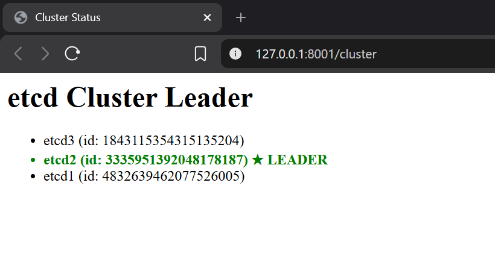
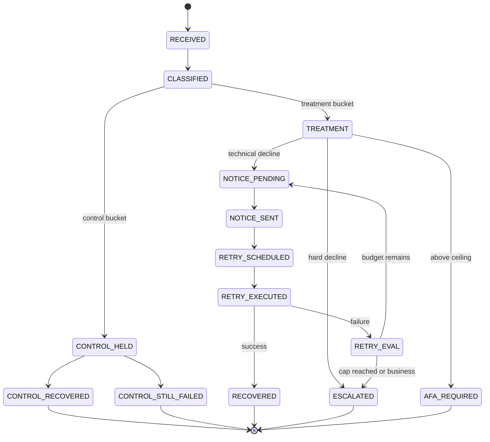
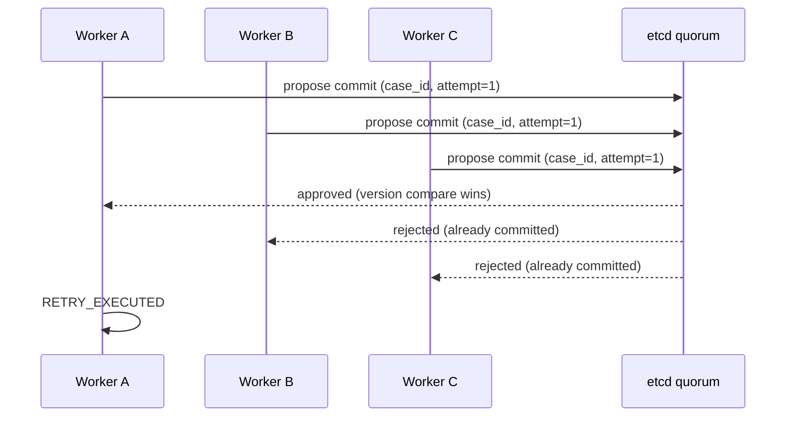

<div align="center">

# ESCROW

### *Everyone builds agents that act. This one decides when it's safe to act.*

Built solo for **Razorpay's Hackathon — Track 3: AI Revenue Recovery**.
It recovers failed UPI Autopay mandates — and the hard part isn't retrying, it's knowing *whether a retry is even legal* before anything fires.


-blue)

</div>

---

## At a Glance

| | |
|---|---|
| **Retry cap** | 1 execution attempt + 3 retries |
| **Peak-hour blackout** | 10:00–13:00 and 17:00–21:30 IST |
| **AFA ceiling** | ₹1,00,000 (mutual funds & insurance) · ₹15,000 (default) |
| **Self-imposed retry spacing** | 72h minimum (mine, not NPCI's) |
| **Self-imposed max retry window** | 48h (mine, not NPCI's) |
| **Control group** | 20% held out, untouched, for honest measurement |
| **Consensus layer** | 3-node etcd quorum, exactly-once commit |
| **Tests passing** | 110[^1] |
| **Ingestion throughput** | 1,157 req/s (`/admin/simulate-failure`, synthetic) |
| **Consensus rejection-path throughput** | 355 req/s (`/admin/execute-retry`, real path) |

---

## Quick Start

```bash
docker-compose up -d etcd1 etcd2 etcd3 postgres

CONFIG_PROFILE=demo \
USE_ETCD=true \
USE_POSTGRES=true \
RAZORPAY_WEBHOOK_SECRET=test_secret_123 \
uvicorn app.main:app --reload
```

Then open `http://localhost:8000/dashboard` or `http://localhost:8000/cluster`. For the full multi-worker consensus demo (the actual point of this project), see [Running the Demo](#running-the-demo).

---

## Table of Contents

- [ESCROW](#escrow)
    - [*Everyone builds agents that act. This one decides when it's safe to act.*](#everyone-builds-agents-that-act-this-one-decides-when-its-safe-to-act)
  - [At a Glance](#at-a-glance)
  - [Quick Start](#quick-start)
  - [Table of Contents](#table-of-contents)
  - [The Problem](#the-problem)
  - [What It Does](#what-it-does)
  - [](#)
  - [Honest Limitations](#honest-limitations)
  - [Architecture](#architecture)
    - [Module Map](#module-map)
    - [State Machine](#state-machine)
    - [Consensus \& Exactly-Once Execution](#consensus--exactly-once-execution)
  - [Data Models](#data-models)
  - [Decline Router](#decline-router)
  - [Retry-Budget Optimizer](#retry-budget-optimizer)
  - [Fraud-Trigger Self-Throttle](#fraud-trigger-self-throttle)
  - [Commit Backend and Consensus](#commit-backend-and-consensus)
  - [Independent Compliance Verifier](#independent-compliance-verifier)
  - [Merkle-Chained Audit Log](#merkle-chained-audit-log)
  - [Advisory Machine Learning](#advisory-machine-learning)
  - [Control/Treatment Split](#controltreatment-split)
  - [Clock Abstraction](#clock-abstraction)
  - [Configuration: What's Regulation, What's Me](#configuration-whats-regulation-whats-me)
  - [Regulatory Citations](#regulatory-citations)
  - [API Reference](#api-reference)
  - [Running the Demo](#running-the-demo)
  - [Testing](#testing)
  - [Load Test Results](#load-test-results)
  - [Fault Shapes and Chaos](#fault-shapes-and-chaos)
  - [Roadmap](#roadmap)
  - [Architecture Decision Records](#architecture-decision-records)
  - [FAQ](#faq)
  - [Contributing](#contributing)
  - [License](#license)
  - [Acknowledgments](#acknowledgments)

---

## The Problem

When a UPI Autopay mandate execution fails, something has to decide what happens next: retry now, retry later, send a notice first, or give up. Most "agentic" systems answer that question by taking an action. This one spends most of its logic answering a narrower question *first*: **is it even allowed to act right now.**



The core is a deterministic finite state machine (`app/core/state_machine.py`) that walks a failed case through states like `NOTICE_PENDING`, `NOTICE_SENT`, `RETRY_SCHEDULED`, and `RETRY_EXECUTED`. Every transition is checked against NPCI's retry rules and RBI's mandate limits **before** it happens, not after.

> [!TIP]
> If you only read one section, read [Honest Limitations](#honest-limitations). It's the part most demos leave out.

---

## What It Does

- **Classifies failures** as *technical* (retryable) or *business* (non-retryable) using a config-driven decline router.
- **Schedules retries** only when NPCI rules allow: notice lead time, peak-hour blackout, retry cap, and AFA ceilings.
- **Executes retries** through a real 3-node etcd quorum, guaranteeing exactly-once approval even across independent workers.
- **Keeps a Merkle-chained audit log** and runs an independent compliance verifier built as a separate implementation from the state machine.
- **Measures recovery honestly** against a 20% control group and reports *incremental* recovery, not raw recovery.

Six behaviors do most of the actual work:

1. A soft/hard decline router
2. A retry-budget optimizer
3. A per-instrument fraud self-throttle
4. A system-wide self-throttle
5. Pre-debit notice lead time and DND-hour deferral
6. A rule-citation receipt attached to every single decision, so you can see exactly which NPCI or RBI clause justified it

> [!NOTE]
> Item 5 used to say "notice deduplication" in an earlier draft, which overstated it — there's a `NoticeRecord` model and a DND-hours check (`app/core/dnd.py`), not an actual batching or dedup service. Fixed the wording rather than rushing a feature in to match the claim.

The system is designed to be **deterministic** and **explainable**. Every action traces to a specific rule, and every compliance check can be independently reproduced.

<div align="center">
  
  
</div>

---

## Honest Limitations

> [!WARNING]
> - No real Razorpay webhook capture — the parser is validated against synthetic payloads, not live webhook traffic.
> - The 72-hour spacing and 48-hour max window are **mine**, not NPCI's. Worth repeating since it's the kind of detail that gets lost in a demo.
> - Admin endpoints are unauthenticated in the demo profile. Don't point this at the internet as-is.
> - Advisory ML only — the modules inform, they never decide. Execution approval runs through the state machine and the consensus backend, not a model.
> - No trained XGBoost model anywhere. The classifier is rule-based with a safe default fallback — shipping something honest and simple beats something that looks trained and isn't.
> - Postgres is optional; the in-memory store is used if `USE_POSTGRES=false`.
> - The TLA+ spec is written but not yet model-checked.

---

## Architecture

### Module Map

<details>
<summary><b>Click to expand the full module table</b></summary>

| Module | Purpose |
|--------|---------|
| `app/models.py` | Data classes for cases, failures, decisions, audit entries, and notices. |
| `app/core/config.py` | Loads YAML config into typed, frozen dataclasses. Splits sourced vs self-imposed rules. |
| `app/core/decline_router.py` | Classifies failure reasons as technical or business. |
| `app/core/webhook_parser.py` | Parses Razorpay webhook payloads into internal events. |
| `app/core/webhook_security.py` | HMAC-SHA256 verification for incoming webhooks. |
| `app/core/state_machine.py` | Deterministic finite state machine that enforces all transitions. |
| `app/core/commit_backend.py` | Interface for exactly-once commit approval. Implementations: etcd, Postgres outbox, in-memory. |
| `app/core/case_store.py` | In-memory store with reverse indexes and Merkle chain. |
| `app/core/postgres_case_store.py` | Postgres-backed implementation of the same store interface. |
| `app/core/verifier.py` | Independent compliance verifier that re-checks the audit trail. |
| `app/core/dnd.py` | Indian DND hours check for notice sending. |
| `app/core/distress.py` | Sliding-window failure detector per instrument. |
| `app/core/bandit.py` | Epsilon-greedy multi-armed bandit for slot selection. |
| `app/core/survival.py` | Kaplan-Meier recovery curve estimation. |
| `app/core/throttle.py` | Per-instrument minimum gap throttle. |
| `app/main.py` | FastAPI app wiring everything together. |
| `app/explain/` | Read-only LLM explainer and decline proposer. |
| `dashboard/streamlit_app.py` | Optional Streamlit dashboard consuming API endpoints. |

All modules are designed for testability: dependencies are injected, external services are abstracted, and the state machine has no side effects.

</details>

### State Machine

The state machine is a **pure function**: current case + event + config + clock → updated case, audit entries, and optionally a `RetryDecision`.



**Invariants enforced:**

- `retries_used` increments **only** on `RETRY_EXECUTED → RETRY_EVAL` (not on throttle cycles).
- Notice lead time is measured between `NOTICE_SENT` and `RETRY_EXECUTED`.
- Peak-hour blackout is applied to scheduled execution times.
- Late success events from `ESCALATED` or `AFA_REQUIRED` are accepted only if the amount matches; otherwise flagged for review.

### Consensus & Exactly-Once Execution



> [!IMPORTANT]
> For a single-instance deployment, a Postgres unique constraint is sufficient on its own. etcd exists for the target state where **multiple independent workers** need to agree without shared memory — the demo runs etcd specifically to prove the consensus path and leader election under failure. Full reasoning in [`docs/adr/0004-why-etcd-vs-postgres-unique-constraint.md`](docs/adr/0004-why-etcd-vs-postgres-unique-constraint.md).

---

## Data Models

All monetary values are **integer paise** (1 rupee = 100 paise). No floats or `Decimal` rupees.

- `RecoveryCase` — the stable anchor for one recovery effort. `case_id` = first failed `payment_id`.
- `PaymentFailureEvent` — one per attempt. Includes reason code, amount, timestamps, and extraction hints.
- `PaymentSuccessEvent` — one per successful capture.
- `RetryDecision` — scheduled retry with reasoning string and commit reference.
- `AuditEntry` — append-only audit record with `prev_hash` and `entry_hash` for Merkle chaining.
- `NoticeRecord` — batched pre-debit notice per instrument.

Validation in `__post_init__` prevents invalid states early.

---

## Decline Router

Maps `reason_code` and optional `error_reason` to a tuple `(decline_class, retryable)`.

- Default: **business / non-retryable** — never guess retryable.
- Config-driven: lists of technical and business codes live in `npci_rules.yaml`.
- Unknown codes go to manual review.

---

## Retry-Budget Optimizer

Schedules retries at the **statistically best legal time**, not just the earliest.

- Legal candidate slots are generated from the NPCI floor (notice lead + spacing).
- If a bandit is provided, it ranks candidates; the state machine asserts the chosen slot is still legal.
- Special case: `insufficient_funds` biases toward the salary window (days 1–7) if it overlaps the legal interval.
- Every decision stores a reasoning string for the rule-citation receipt.

---

## Fraud-Trigger Self-Throttle

NPCI rules set a floor, but retrying too aggressively can still trip the customer's bank fraud detection.

- The instrument throttle enforces a minimum gap per `instrument_id`.
- `DistressDetector` counts recent failures per instrument and can block retries if too many occur within a window.
- `execute_retry` escalates immediately if the instrument is distressed.

---

## Commit Backend and Consensus

Exactly-once execution is achieved with a commit backend:

- **`EtcdQuorumBackend`** — uses an etcd transaction with version compare. First commit wins; later commits are rejected.
- **`PostgresOutboxBackend`** — a unique constraint on `(case_id, attempt_number)` does the same job.
- **`InMemoryCommitBackend`** — for local development.

The commit backend stores a **full effect object** (`{case_id, attempt, to_state, at}`), not just a boolean, so the case store can be reconciled from the commit log after a crash. A reconciliation function runs on startup to heal any case where a commit exists but local state didn't advance.

---

## Independent Compliance Verifier

A **separate implementation** from the state machine. It re-checks the audit trail for:

- Max retries not exceeded
- Notice lead time respected
- Retry spacing by `executed_at`
- Peak-hour blackout
- AFA ceiling
- Bucket immutability

Adversarial tests deliberately violate each rule to confirm the verifier catches them. If the state machine and the verifier ever disagree, that's a bug — and the verifier is the one that gets believed.

> [!WARNING]
> **A bug I kept in the record, not swept under it:** for the first ~20 hours of the build, the verifier compared the gap between `NOTICE_SENT` and `RETRY_SCHEDULED` instead of `NOTICE_SENT` and `RETRY_EXECUTED`. Because both of the first two timestamps get logged synchronously, the gap looked fine even when the actual notice lead time wasn't respected. Full writeup in [`docs/WHAT_BROKE.md`](docs/WHAT_BROKE.md).

---

## Merkle-Chained Audit Log

Every `AuditEntry` includes:

- `prev_hash` — SHA-256 of the previous entry
- `entry_hash` — SHA-256 of the serialized entry including its `prev_hash`

A standalone `verify_chain.py` can validate the entire chain independently of the running service.

---

## Advisory Machine Learning

These modules are **advisory only** and never decide execution:

- `bandit.py` — epsilon-greedy slot suggestion
- `survival.py` — Kaplan-Meier recovery probability
- `distress.py` — sliding-window failure detector
- `app/explain/llm_explainer.py` — read-only case explanation via LLM if configured, else a deterministic fallback
- `app/explain/decline_proposer.py` — advisory classification for unknown decline codes

> [!CAUTION]
> None of these get a vote on whether execution happens. The import boundary is enforced with `.importlinter`: the `explain` package cannot import the state machine or commit backend. That decision belongs to the state machine and the verifier, full stop.

---

## Control/Treatment Split

- 20% of eligible failures go to **control**: observed, no action taken.
- 80% go to **treatment**: the agent acts.
- Bucket assignment is deterministic (SHA-256 of `case_id`) and immutable.
- **Incremental recovery** = treatment recovery rate − control recovery rate.

---

## Clock Abstraction

The same code runs at two speeds:

- `RealClock` — wall-clock time.
- `AcceleratedClock` — scales time for the demo.

The demo uses `AcceleratedClock` with `time_scale=3600x`, so 72 hours pass in 72 seconds. Property tests always run against `prod` config with real constants — the acceleration is a demo-only convenience, never a test shortcut.

---

## Configuration: What's Regulation, What's Me

Two different kinds of rules live in `config/npci_rules.yaml`, and they're kept in separate places on purpose.

| | `npci_rules` | `self_imposed` |
|---|---|---|
| **Source** | Actual NPCI and RBI circulars | My own conservative defaults |
| **Examples** | Max retries, notice lead, peak windows, AFA ceilings | 72h minimum retry spacing, 48h max retry window |
| **Tunable in spirit?** | No — only tunable in the sense that YAML lets you edit anything | Yes, these are opinions, not law |
| **Validated?** | N/A | Loader rejects spacing below 24h |

> [!IMPORTANT]
> If you're evaluating this for compliance: treat `npci_rules` as the part that has to be right, and `self_imposed` as the part that's an opinion. If a number in `npci_rules` doesn't match the circular text, that's a bug in the config, not a design choice.

---

## Regulatory Citations

| Circular | Date | What it sets |
|---|---|---|
| NPCI circular | Dated May 21, 2025 · effective Aug 1, 2025 | Caps retries at 1 execution + 3 retries. Blocks retries during peak hours: 10:00–13:00 and 17:00–21:30 IST. |
| RBI circular RBI/2023-2024/88 | Dec 12, 2023 | Sets the Additional Factor of Authentication (AFA) ceiling at ₹1,00,000 for mutual funds and insurance premiums; ₹15,000 default for everything else. |

---

## API Reference

<details>
<summary><b>Click to expand all endpoints</b></summary>

| Method | Path | Description |
|--------|------|-------------|
| GET | `/health` | Liveness, profile, backend flags |
| POST | `/webhook/payment-failed` | Real webhook ingestion with HMAC verification |
| POST | `/webhook/payment-succeeded` | Success webhook |
| POST | `/admin/simulate-failure` | Synthetic failure injection (demo) |
| POST | `/admin/send-notice/{case_id}` | Move from `NOTICE_PENDING` to `RETRY_SCHEDULED` |
| POST | `/admin/execute-retry/{case_id}` | Execute pending retry via commit backend |
| POST | `/admin/advance-clock` | Advance demo clock |
| POST | `/admin/simulate-success` | Synthetic success |
| POST | `/admin/release-throttles` | Release all `THROTTLED` cases |
| POST | `/admin/escalations/{case_id}/resolve` | Human resolution |
| POST | `/admin/chaos/kill-leader` | Stop the actual etcd leader |
| POST | `/admin/chaos/spike` | Simulated failure spike |
| GET | `/cluster/status` | etcd member list and leader |
| GET | `/cluster` | HTML cluster visualizer |
| GET | `/dashboard/metrics` | Recovery metrics |
| GET | `/dashboard` | HTML dashboard |
| GET | `/cases` | List all cases |
| GET | `/cases/{id}/receipt` | Audit trail receipt |
| GET | `/cases/{id}/verify` | Independent compliance verifier |
| GET | `/cases/{id}/verify_chain` | Merkle chain verification |
| GET | `/cases/{id}/explain` | Read-only case explanation |
| POST | `/compliance/check` | Public oracle: allowed, reason, next time |
| POST | `/decline/propose` | Advisory classification proposal |
| GET | `/bandit/suggest` | Bandit slot suggestion |
| GET | `/survival/recovery_curve` | Kaplan-Meier curve |

</details>

---

## Running the Demo

**Single worker:**

```bash
export CONFIG_PROFILE=demo
export USE_ETCD=true
export USE_POSTGRES=true
export RAZORPAY_WEBHOOK_SECRET=test_secret_123

docker-compose up -d etcd1 etcd2 etcd3 postgres
uvicorn app.main:app --reload
```

Without those environment variables the app boots on its defaults: `prod` profile, in-memory store, no etcd. It'll run — it just won't show you anything interesting.

> [!WARNING]
> **Don't use `uvicorn --workers N` for the consensus demo.** A plain `uvicorn --workers 4` spins up four processes that each get their own in-memory case store unless `USE_POSTGRES` is set, so they never actually contend for the same case and the demo falls flat. Three separate processes on separate ports, all pointed at the same etcd cluster and Postgres, is the setup that actually works.

**Multi-instance (to see exactly-once behavior under real contention):**

```bash
export CONFIG_PROFILE=demo
export USE_ETCD=true
export USE_POSTGRES=true
export RAZORPAY_WEBHOOK_SECRET=test_secret_123

docker-compose up -d etcd1 etcd2 etcd3 postgres

uvicorn app.main:app --port 8001 &
uvicorn app.main:app --port 8002 &
uvicorn app.main:app --port 8003 &
```

Then either:

```bash
python scripts/concurrency_test_multi.py <case_id> 20
```

...and observe exactly one success and 19 rejections, or fire the same retry-execution request at all three ports at once — one commits, the rest get rejected by the etcd quorum. That's the whole point of the demo.

Then drive a case through the admin endpoints, or watch it from `dashboard/streamlit_app.py`.

---

## Testing

```bash
pytest -q
```

**110 tests pass**[^1] — verified at time of writing.

**Categories:**

- Unit tests for models, router, parser, security, store, state machine, verifier
- Hypothesis property tests for 8 invariants
- Fault-injected property tests with scripted commit failures
- Contract tests proving etcd and Postgres backends share the same idempotency behavior
- Adversarial verifier tests for each NPCI rule
- Endpoint tests using FastAPI `TestClient`

For the incidents that got the build here, including the verifier bug above, see [`docs/WHAT_BROKE.md`](docs/WHAT_BROKE.md).

---

## Load Test Results

| Endpoint | Throughput |
|---|---|
| `/admin/simulate-failure` | 1,157 req/s (synthetic failure ingestion) |
| `/admin/execute-retry` | 355 req/s (real retry path, rejection dominated) |

> [!NOTE]
> The 1,157 figure doesn't touch the etcd-backed commit path at all, so treat it as an upper bound on ingestion, not proof of consensus throughput. There's no dedicated commit-path benchmark yet — better to say that plainly than let the numbers imply something they don't. The real bottleneck is etcd/Postgres I/O, not Python CPU.

---

## Fault Shapes and Chaos

`scripts/etcd_fault_shapes.py` runs:

- Kill a follower, restart it.
- Kill the leader (twice), restart.
- Restart the entire cluster.

The system elects a new leader and continues. The script prints cluster status after each fault.

---

## Roadmap

- [ ] Real Razorpay webhook capture, replacing the synthetic payload validation
- [ ] TLA+ model checking — the spec exists, it hasn't been run through a model checker yet
- [ ] A trained ML classifier to replace the current rule-based one
- [ ] A multi-rail router for payment rails beyond UPI
- [ ] A Wasm build of the state machine, for portability outside Python
- [ ] Multi-DC failover for the consensus layer

---

## Architecture Decision Records

| ADR | Decision |
|---|---|
| [`0001`](docs/adr/0001-etcd-for-quorum-layer.md) | etcd for the quorum layer |
| [`0002`](docs/adr/0002-clock-abstraction-for-demo-speed.md) | Clock abstraction for demo speed |
| [`0003`](docs/adr/0003-quorum-scope-execute-approval-only.md) | Quorum scope: execute-approval only |
| [`0004`](docs/adr/0004-why-etcd-vs-postgres-unique-constraint.md) | Why etcd vs. a Postgres unique constraint |

---

## FAQ

<details>
<summary><b>Why etcd instead of just a Postgres unique constraint?</b></summary>
<br>

For a single instance, the Postgres constraint alone is enough. etcd is there for the case of multiple independent workers with no shared memory — see [ADR 0004](docs/adr/0004-why-etcd-vs-postgres-unique-constraint.md).
</details>

<details>
<summary><b>What happens if the state machine and the verifier disagree?</b></summary>
<br>

That's treated as a bug, not an edge case to paper over — and the independent verifier is the one that gets believed, since it's a separate implementation checking the same rules through a different code path.
</details>

<details>
<summary><b>Can the bandit or the distress detector block a retry?</b></summary>
<br>

No. Every ML component in this project — the bandit, the survival model, the distress detector, the LLM explainer — is advisory or read-only. Execution approval runs exclusively through the state machine and the consensus backend, and that import boundary is enforced by `.importlinter`.
</details>

<details>
<summary><b>Are the 72h spacing and 48h window required by NPCI?</b></summary>
<br>

No — those are conservative defaults chosen for this project, kept separate from `npci_rules` in config specifically so that distinction stays visible. See [Configuration: What's Regulation, What's Me](#configuration-whats-regulation-whats-me).
</details>

<details>
<summary><b>I ran <code>uvicorn --workers 4</code> and the consensus demo didn't do anything interesting. Why?</b></summary>
<br>

Each worker process gets its own in-memory case store unless `USE_POSTGRES` is set, so they never contend for the same case. Run three separate processes on separate ports instead — see [Running the Demo](#running-the-demo).
</details>

---

## Contributing

This started as a solo hackathon build for Razorpay Track 3, so there's no established contributor workflow yet — but issues and PRs are welcome once judging wraps up. Good first places to dig in:

- New reason codes for the decline router
- Taking a swing at the TLA+ model checking mentioned in the [Roadmap](#roadmap)
- Wiring up real Razorpay webhook capture in place of the synthetic payloads

If you're extending anything that touches compliance rules, please keep the `npci_rules` vs `self_imposed` split intact — see [Configuration](#configuration-whats-regulation-whats-me) for why that boundary matters.

---

## License

No `LICENSE` file is committed yet. Until one is added, treat this as all-rights-reserved for hackathon judging purposes. MIT is the intended license post-hackathon — update this section (and the badge at the top) once `LICENSE` is actually committed.

---

## Acknowledgments

- NPCI and RBI, for publishing the circulars this project is grounded in.
- The Razorpay hackathon organizers, for Track 3.
- The maintainers of FastAPI, etcd, Hypothesis, Streamlit, and pytest — this project leans on all of them directly.

---

<div align="center">

**Made for Razorpay's Hackathon — Track 3: AI Revenue Recovery.**

*Deterministic where it counts. Advisory everywhere else. Honest about both.*

</div>

[^1]: Run `pytest -q` yourself for the live count.
